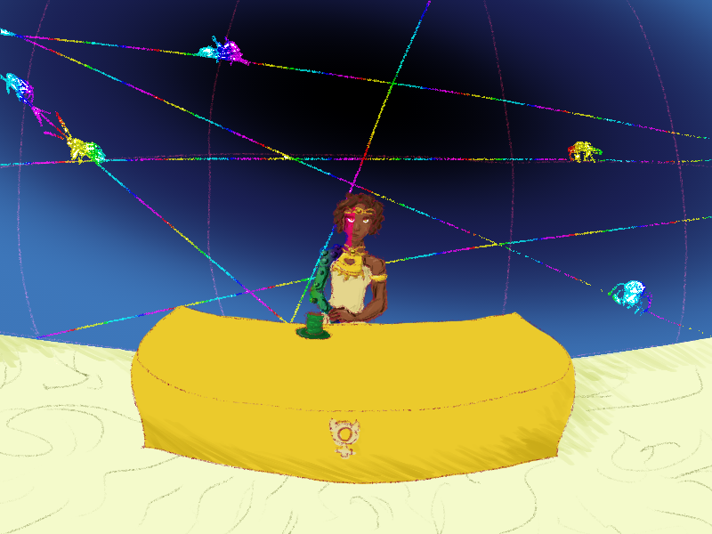

Warning klaxons and accompanying lights had been going for an hour already, and they were likely to go four more at the rate her people were seeing pushback. Ayesha Ura, acting head of the Bureau of Destiny and foremost of the Sidereal Exalted, breathed deeply to calm herself. She took a sip of tea and forced herself to remain at her desk.

Before she could properly investigate the alarm's source, she had to stop it – and calm the mass panic it continued to drive. Blessedly, the Shogun-Regent of the Aerial Legion had been of the same opinion. Their joint statement that the Legion would not deploy until the threat had been confirmed quelled most of the terrified demands that Heaven take unprecedented military action in Creation.

No, the alarms had to be mistaken. There was no other sign of invasion. No cracking the dome of the sky; no hordes of demons; no gods unaccounted for. Emergency comms with covert resources in the region showed that none had any idea of the panic presently gripping the Heavenly City. What the alarms indicated was simply impossible. Every spirit in the North would be shaken to their bones.

Everything was fine. Another Infernal scare. Everything was under control. Everything except her own apprentice, much as usual.

On cue, the familiar knock came at her door.

"Please, come in," she said, sighing to herself one last time.

"Good evening, Sifu. Forgive me if this is a bad time."

"I was hoping to see you, my favorite student," Ayesha said, only half snidely. "Take a seat."

Trishula Murmur did not put on airs. That was the problem.

The wiry girl wore a wide-brimmed mandarin's hat with common green shirt and slacks typical of more junior Bureau members than she actually was. Her hair was an untamed mane which bristled past her shoulders like a hedge of copper thorns. In the years Ayesha had been with her, she'd grown from chubby tomboy to sharp, regal looks which would not be out of place in the Imperial Capital. But in all that time, one thing had not changed.

Trishula's sharp emerald eyes always held a supremely confident glare. They betrayed a youthful zeal which would burn even herself if she did not hold her temper. All this time, Ayesha had tried to rein her in. Unfortunately– Unfortunately–

Trishula had "taken a seat" on the desk. Ayesha shook her head and joined her apprentice, sitting back to back.

"Do you realize what you've done, young lady?"

"Scared a bunch of useless hedonists into actually doing their jobs for once?"

"And?"

"And that's it. Damn the consequences. We're not playing by the old rules anymore. They died when I was born."

Ayesha pursed her lips. Where to start this time? For all the effort Trishula put into tearing down the genuinely good parts of Kejak's works, she was just as pigheaded as her past life.

"Trishula. Think for a minute. Just a minute. Think about how many people may get hurt if this panic continues."

This at least seemed to slow the girl.

"I have," she said solemnly. "You don't think I make these decisions rashly, do you? You haven't been paying attention."

"I think you've been making them without the benefit of experience."

"No, no, no. It's just not _my_ experience."

There it was. The circumstances of Trishula's admission to the Bureau of Destiny were sealed by an authority Ayesha could not identify. Two of the four who had gone with her to retrieve the girl called her a poisoned cup. But they couldn't let Kejak Chejop's next incarnation slip away. Nor could they just kill her and let Fate choose another.

"I don't want to hurt anyone, Sifu, but I don't think I can properly guide Creation if all the mechanisms of Heaven are _working against me_! The Celestial gods are all complicit. They don't have to change, but they can't stay here. Not if you won't accept Dad's offer."

There it was. So many of Ayesha's own long-spun plans had gone up in smoke shortly before she had agreed to mentor the girl. The Lotus Massacre. A trap which attempted to slay most of their kind to utterly unsettle the ancient bureaucracy which monitored and protected Creation. The last thin twine of Kejak's Destiny and a disagreement betweent the Demon Lords was all that had spared half of Fate's Chosen. Doing the work of two star-chosen had been exhausting – but never so much as convincing teenagers that the corrupt Celestial gods had to be respected so they could be manipulated.

More than ever, every Sidereal life was precious. Even if that life was so clearly touched by those aforementioned Demon Lords.

Ayesha looked absently at the fine machinery of her glimmering starmetal arm. She'd lost the right half of her body along with so many of her colleagues, by the blades of the Infernal Exalted. It was not too late for Trishula to have an "accident" and remove the question of the apprentice's corruption. It would be easy enough, and maybe the situation in the Bureau had stabilized enough to suffer the scandal. But there was the matter of her parentage.

'_Why not?_' the young Sidereals sometimes asked when they had the courage. '_Can we really trust none among Hell's Chosen more than the worst of the gods? They at least know human suffering. Why not use the power of the oathbound titans to compel the renegade gods to their original duties?_'

Duke Murmur was… stable. He was as admirable as the Infernal Exalted could be. His great moving city nearly had First Age standards of living for the growing number of humans it sustained. Only… it was a surveillance state driven by the will of one man… driven in turn by the will of mad titans. And not at least tempered by Ayesha's best "advisors".

One didn't need to read the Loom of Fate to see that was a nonstarter.

The elder clapped once to close the discussion.

"The counteroffer I made your father remains on the table. We will not revisit the ethics (or political fallout) of _mind control_ today. Alright? Now, if I give you a realistic response plan – a new one – will you convince your friends to stop obstructing the procedures for disabling the alarms? We need Heaven calm so no one does anything drastic."

"Fine, fine," Trishula said as she dropped to the floor.

She clacked her one-toed geta on the white marble a few times for emphasis. Owing to her impatience, she was one of the fastest in the new generation and would vanish in a blink if not stopped.

She asked a question first, though: "Really, do you expect anything catastrophic? Who would believe the alarms weren't broken? I think even Dad would laugh at it."

"No. But it may be a red herring to divert resources from stopping that project your father has recently joined."

"What? Painting Whitewall green?"

Ayesha sighed. It wasn't that Trishula couldn't read between the lines. She had the best tutors in the Bureau. Duke Murmur was himself a master of propaganda. But Trishula refused to speak in code. She was without a doubt the worst Chosen of Secrets.

"See to your friends," Ayesha said firmly.

Of course, being such a self-sure pain in the neck meant that Trishula had most of the young Sidereals following her lead. And if there was one field in which Trishula was genuinely excellent, it was using the laws of Heaven to frame their mischief as meritorious.

"After that, you want me to pass the message to ol' Ragara?"

"Apprentice, silence. Since you are so clearly concerned for the safety of Creation and the functioning of the blasphemy alarms, it will be your duty to conduct the investigation into their sounding. Alone. You are to report to the Northern Convention within the hour."

Trishula smirked, then overacted begging for mercy.

"But what if there's really a-?"

"Not one word more."
